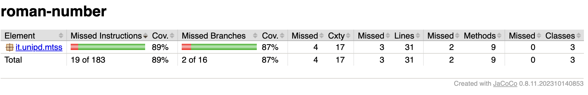

# MTSS_Prova_Pratica2

[INFO] Scanning for projects...
[INFO] 
[INFO] ---------------------< it.unipd.mtss:roman-number >---------------------
[INFO] Building roman-number 1.0
[INFO] --------------------------------[ jar ]---------------------------------
[INFO] 
[INFO] --- maven-clean-plugin:3.1.0:clean (default-clean) @ roman-number ---
[INFO] Deleting /home/francesco/Desktop/MTSS_Prova_Pratica2/target
[INFO] 
[INFO] --- maven-resources-plugin:3.0.2:resources (default-resources) @ roman-number ---
[INFO] Using 'UTF-8' encoding to copy filtered resources.
[INFO] skip non existing resourceDirectory /home/francesco/Desktop/MTSS_Prova_Pratica2/src/main/resources
[INFO] 
[INFO] --- maven-compiler-plugin:3.8.0:compile (default-compile) @ roman-number ---
[INFO] Changes detected - recompiling the module!
[INFO] Compiling 3 source files to /home/francesco/Desktop/MTSS_Prova_Pratica2/target/classes
[INFO] 
[INFO] --- maven-resources-plugin:3.0.2:testResources (default-testResources) @ roman-number ---
[INFO] Using 'UTF-8' encoding to copy filtered resources.
[INFO] skip non existing resourceDirectory /home/francesco/Desktop/MTSS_Prova_Pratica2/src/test/resources
[INFO] 
[INFO] --- maven-compiler-plugin:3.8.0:testCompile (default-testCompile) @ roman-number ---
[INFO] Changes detected - recompiling the module!
[INFO] Compiling 3 source files to /home/francesco/Desktop/MTSS_Prova_Pratica2/target/test-classes
[INFO] 
[INFO] --- maven-surefire-plugin:2.22.1:test (default-test) @ roman-number ---
[INFO] 
[INFO] -------------------------------------------------------
[INFO]  T E S T S
[INFO] -------------------------------------------------------
[INFO] Running it.unipd.mtss.AppTest
[INFO] Tests run: 1, Failures: 0, Errors: 0, Skipped: 0, Time elapsed: 0.042 s - in it.unipd.mtss.AppTest
[INFO] 
[INFO] Results:
[INFO] 
[INFO] Tests run: 1, Failures: 0, Errors: 0, Skipped: 0
[INFO] 
[INFO] 
[INFO] --- maven-jar-plugin:3.0.2:jar (default-jar) @ roman-number ---
[INFO] Building jar: /home/francesco/Desktop/MTSS_Prova_Pratica2/target/roman-number-1.0.jar
[INFO] ------------------------------------------------------------------------
[INFO] BUILD SUCCESS
[INFO] ------------------------------------------------------------------------
[INFO] Total time:  2.749 s
[INFO] Finished at: 2025-05-10T12:05:25+02:00
[INFO] ------------------------------------------------------------------------

